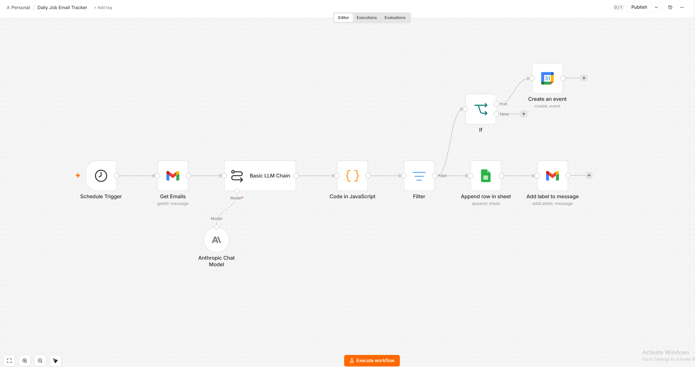

# Job Application Tracker


An automated pipeline that reads my Gmail every day, uses Claude (Anthropic) to understand each job-related email, logs every application, rejection, interview invite, and assessment into a Google Sheet, and automatically adds interview invites to my Google Calendar. Built end to end with self-hosted n8n.

## The problem

While job hunting, I was applying through many different channels (LinkedIn, Indeed, company career pages, and direct email). Every application produced a confirmation or a response email, but they arrived in different formats and quickly became impossible to track by hand. I wanted a single, always-current sheet showing what I applied to, where, and how each application ended, without any manual data entry.

## What it does

Every day, the workflow:

1. Pulls recent job-related emails from Gmail, filtered by date and keywords.
2. Sends each email to Claude, which reads it and returns clean, structured data.
3. Keeps only the emails that are actually about my own job applications.
4. Appends a row to a Google Sheet with the company, role, location, source, status, salary, and any rejection reason.
5. When an email is an interview invite with a date and time, creates an event on my Google Calendar automatically.
6. Tags each processed email in Gmail so it is never logged twice.

The result is a self-updating job-search dashboard that needs zero manual input.

## How it works

The pipeline is a single n8n workflow with a branching flow:

```
Schedule Trigger
      |
Gmail: Get Many            (fetch recent emails, filtered by date, label, and keywords)
      |
Basic LLM Chain + Anthropic Chat Model (Claude Haiku)
      |                    (extract structured JSON from unstructured email text)
Code (JavaScript)          (parse the model output into clean fields)
      |
Filter                     (keep only genuine job-application emails)
      |
      |--> Google Sheets: Append Row --> Gmail: Add Label   (log every job email, then tag it)
      |
      '--> If (type = interview_invite) --> Google Calendar: Create Event
```

### The core idea

The hard part of this problem is that job emails are unstructured and inconsistent. A rejection, an interview invite, and an application confirmation all look completely different. Rule-based filtering cannot handle that reliably, so I use Claude as the extraction layer. Each email is passed to the model with a strict prompt that forces a single JSON object with fixed fields. A short JavaScript step then parses that JSON into columns the sheet can store.

After the filter, the flow splits. Every job email is logged to Google Sheets and then tagged in Gmail. Separately, an If node checks whether the email is an interview invite with a date and time, and if so, a Google Calendar node creates the event.

Deduplication is handled with a Gmail label: once an email is logged, it is tagged, and the daily fetch excludes anything already tagged. This keeps the sheet clean even when runs overlap.

## Data captured per email

| Field | Description |
|-------|-------------|
| Email date | Date the email was sent |
| Type | application_confirmation, rejection, interview_invite, assessment, or other |
| Company | Hiring company |
| Role | Job title |
| Location | Location, if stated |
| Source | Where the application was made (LinkedIn, Indeed, company site, direct email) |
| Reason | Rejection reason, when one is given |
| Email subject | Original subject line |
| Applied date | Date the person applied, when the email states it |
| Days since applied | Days between the applied date and today (sheet formula) |
| Work model | remote, hybrid, or onsite |
| Seniority | intern, junior, mid, senior, or lead |
| Application method | email or portal |
| Salary | Salary or range, when mentioned |
| Rejection quality | generic or personalized, for rejection emails |
| Permalink | Direct link back to the original Gmail message |

## Tech stack

- **n8n** (self-hosted Community Edition, run locally via Docker) as the automation engine
- **Anthropic Claude API** (Claude Haiku) for reading and structuring email content
- **Gmail API** (OAuth2) as the email source and for labeling
- **Google Sheets API** (OAuth2) as the data store
- **Google Calendar API** (OAuth2) for creating interview events
- **JavaScript** in an n8n Code node for parsing the model output
- **Docker** for running n8n in an isolated, reproducible environment

## Design decisions

- **Claude Haiku over larger models:** classification and extraction do not need heavy reasoning, so the smallest, cheapest model was the right fit. Processing a month of emails costs a few cents.
- **Self-hosted n8n:** run locally with full control over the workflow and credentials, with no subscription cost.
- **Keyword-filtered fetch:** the Gmail search narrows to likely job emails before they reach the model, which cuts cost and avoids processing irrelevant mail.
- **Branching after the filter:** all job emails are logged, while only interview invites trigger a calendar event, so each path does exactly one job.
- **Label-based deduplication:** simpler and more reliable than tracking message IDs in a separate store, and it keeps the logic entirely inside Gmail.
- **One row per email (v1):** an intentionally simple data model that is easy to sort and pivot. A future version can consolidate to one row per application with a status pipeline.

## Running it

The workflow file in this repository can be imported directly into any n8n instance (Import from File). After importing, four credentials need to be reconnected: Anthropic, Gmail, Google Sheets, and Google Calendar. The three Google services share a single OAuth client.

To backfill historical emails, the Gmail search filter in the Get Emails node is temporarily widened to a larger date range, the workflow is run once, and then the filter is set back to its daily range. The Gmail label filter ensures nothing already logged is duplicated.

## Possible improvements

- Consolidate to one row per application with a status pipeline (Applied, Screening, Interview, Offer, Rejected).
- Add source-performance analytics to measure response rate per channel.
- Send a daily summary email of new applications and responses.
- Connect the sheet to a dashboard for weekly trends.

## Notes

This project was built as a practical automation for my own job search and as a demonstration of connecting APIs, orchestrating a multi-step workflow, and using an LLM to turn messy real-world text into structured, usable data.

---

**Author:** Khushi Verma
**LinkedIn:** https://www.linkedin.com/in/khushi-verma-marketing/
